# Storage & Recovery Deep Dive (Project 6 of 6)

Hands-on Azure lab built for AZ-104 (Microsoft Azure Administrator) preparation. It targets the two weakest areas from my first exam attempt, **backup and recovery** and **storage**, with a completed VM disk restore from a Recovery Services vault, blob versioning and soft delete, a lifecycle management policy, a storage firewall, and a SAS token tested before and after expiry.

> Related repos: [VM-RBAC-Config](https://github.com/waynethedon/VM-RBAC-Config) (Project 1) · [VNet-Storage-Config](https://github.com/waynethedon/VNet-Storage-Config) (Project 2) · [Monitoring-Backup-Config](https://github.com/waynethedon/Monitoring-Backup-Config) (Project 3) · [Entra-Identity-Config](https://github.com/waynethedon/Entra-Identity-Config) (Project 4)

---

## Architecture

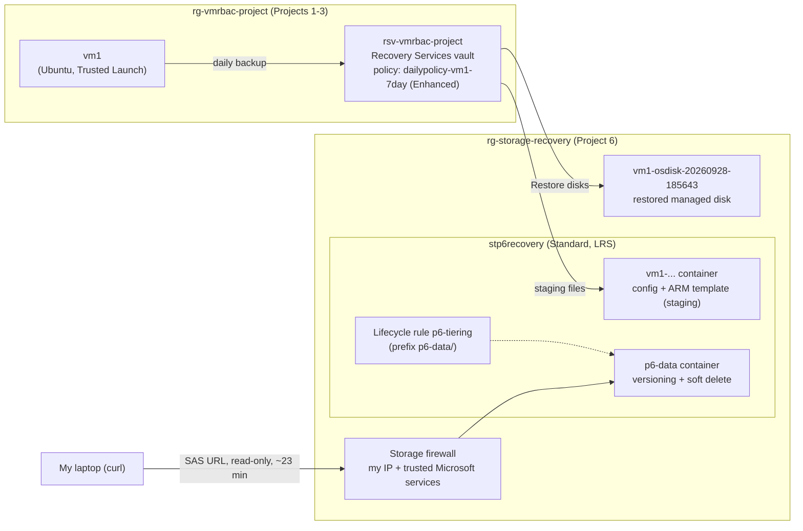

## What was built

| Requirement | Implementation |
|---|---|
| Real restore from Project 3's vault | **Restore disks** from `rsv-vmrbac-project` using the 9/27/2026 10:11 PM (local) recovery point, into a new resource group `rg-storage-recovery`, with `stp6recovery` as the staging location. Job completed in about 66 seconds |
| Second storage account with data protection | `stp6recovery`: Standard, LRS, North Central US. Blob versioning on, blob soft delete 7 days, container soft delete 7 days |
| Versioning and soft delete, demonstrated | Overwrote a blob and restored the earlier version; deleted a blob and recovered it |
| Lifecycle management | Rule `p6-tiering` scoped to prefix `p6-data/`: base blobs to Cool after 30 days, deleted after 365 days; previous versions deleted after 30 days |
| SAS token | Read-only, HTTPS-only service SAS on one blob. Used successfully, then rejected after expiry |
| Redundancy comparison | Written comparison of LRS / ZRS / GRS / GZRS (below). LRS deployed |

## Key decisions

**Restore disks instead of file-level recovery or Create new VM.** Project 3's file-level restore stalled indefinitely at the disk-attach step. Restore disks is a platform-side operation: Azure Backup writes the managed disk directly, with no script running on the VM and no outbound internet needed (the VM's subnet still denies outbound internet). It also avoids allocating a new VM, which matters in a free-trial subscription that repeatedly hit `AllocationFailed` capacity errors in Project 1. It does not give a running VM. It produces the disk plus an ARM template (`azuredeploy...json`) that can deploy one.

**A new resource group outside the tag policy's scope.** The tag-enforcement Deny policy from Project 1 is assigned to `rg-vmrbac-project` only. Auto-generated resources failed that policy in Projects 2 and 3, so Project 6 resources went into `rg-storage-recovery`, keeping the policy intact and enforced where it was designed to be.

**New storage account as the staging location.** Restore disks needs a storage account in the vault's region. Project 2's account has public network access disabled, so a new account was created and used both for staging and for the storage exercises.

**Storage firewall, not disabled public access.** The SAS test runs from my laptop over the internet, so public access couldn't be disabled as in Project 2. Instead the account allows only my client IP, with **Allow trusted Microsoft services** kept on so Azure Backup can still reach the staging account for future restores.

**Lifecycle rule scoped by prefix.** The rule applies only to `p6-data/`, keeping it away from Azure Backup's staging container.

**Read-only, HTTPS-only, short-lived SAS.** Least privilege on every dimension the token supports: one blob, read permission only, HTTPS only, about 23 minutes (19:37 to 20:00 UTC).

## Challenges & troubleshooting

**Two times for the same recovery point.** The vault's backup items list showed the recovery point as **9/27/2026 10:11:03 PM**, while the restore job showed **9/28/2026 2:11:03 AM**. It is the same point: the job page displays UTC and the list displayed local time (Eastern, UTC-4). The restored disk's source restore point (`AzureBackup_20260928_021102`) is also UTC.

**Only one blob version appeared after "overwriting".** The Versions tab initially listed a single version, because the second upload hadn't actually replaced the blob. Re-uploading with **Overwrite** checked produced the expected two versions.

**Recovering a deleted blob works differently with versioning on.** With versioning enabled, deleting a blob turns its current version into a previous version. Recovery was done by promoting that version with **Make current version**, not with a plain undelete. Soft delete then protects the versions themselves: if a version is deleted, it remains recoverable for the 7-day retention period.

**`zsh: parse error near '&'` when testing the SAS URL.** A SAS URL contains `&` separators, which zsh interprets as shell syntax. Wrapping the URL in double quotes fixed it.

**Findings from the restored disk.** Its security type is **Trusted launch**, which is why vm1's backup uses the **Enhanced** policy (required for Trusted Launch VMs). Its encryption shows **platform-managed key**: Project 1's Encryption at Host is a VM setting and does not travel with a restored disk. The restore also copied vm1's tags onto the disk, so the tag policy likely wouldn't have blocked this restore even inside `rg-vmrbac-project` (not tested).

**Storage firewall nearly locked me out.** Selecting "Enabled from selected networks" with no IP rule would have blocked all public access, including my own browser. Adding the client IP before saving avoided that.

## Verification

> Screenshots in [`/screenshots`](./screenshots).

**VM disk restore**
1. Backup item for vm1 before the restore: pre-check Passed, last backup Success, latest restore point 9/27/2026 10:11:03 PM, policy `dailypolicy-vm1-7day` (Enhanced). 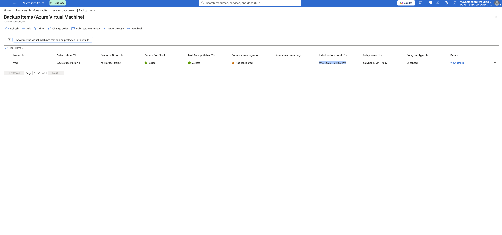
2. Restore job details: job type **Recover disks**, target resource group `rg-storage-recovery`, staging account `stp6recovery`, 2:56:10 PM → 2:57:16 PM, 100% completed. 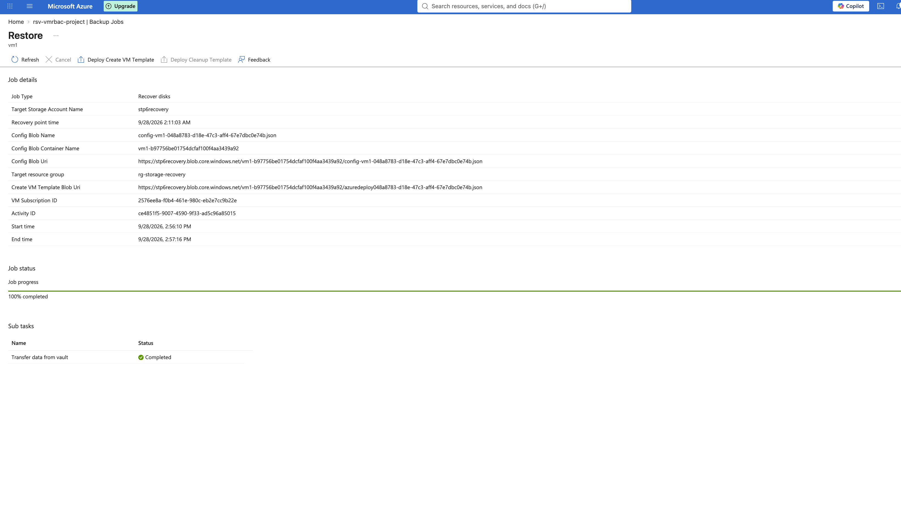
3. Restored disk `vm1-osdisk-20260928-185643`: create option **Restore**, source restore point `AzureBackup_20260928_021102`, 30 GiB Premium SSD LRS, Trusted launch, unattached. The disk also carries vm1's original `projects: vmrbac` tag plus an `RSVaultBackup` tag whose GUID matches the staging files, tying disk, template and job together. 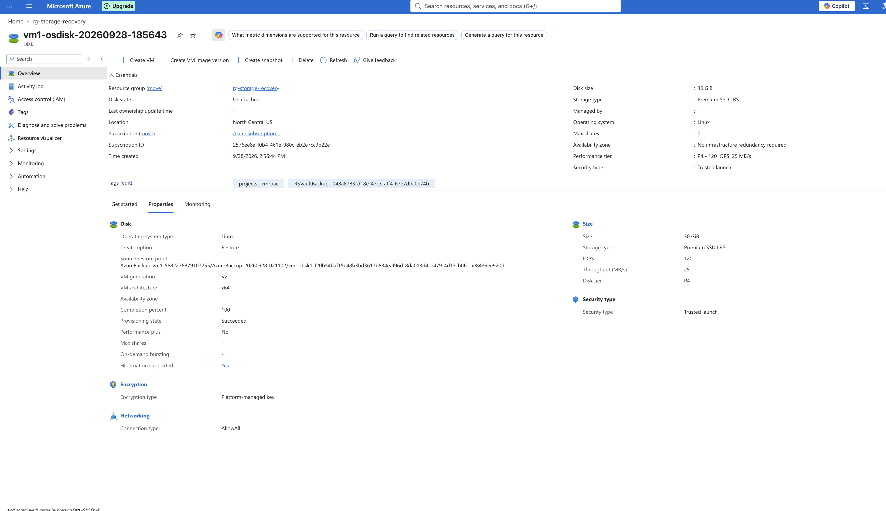
4. Staging container written by Azure Backup: VM config, parameters, and the ARM template to deploy a VM from the restored disk. 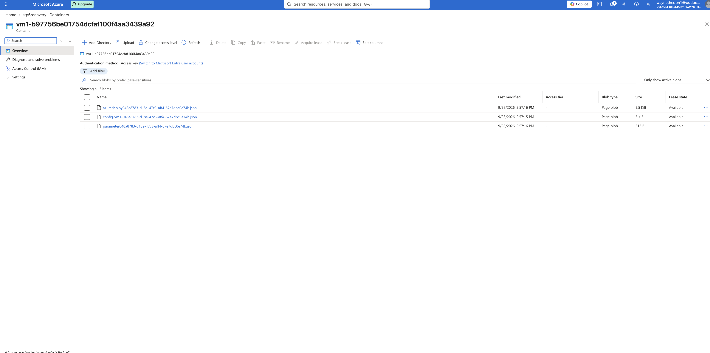

**Data protection**

5. Data protection settings on `stp6recovery`: blob soft delete 7 days, container soft delete 7 days, versioning on. 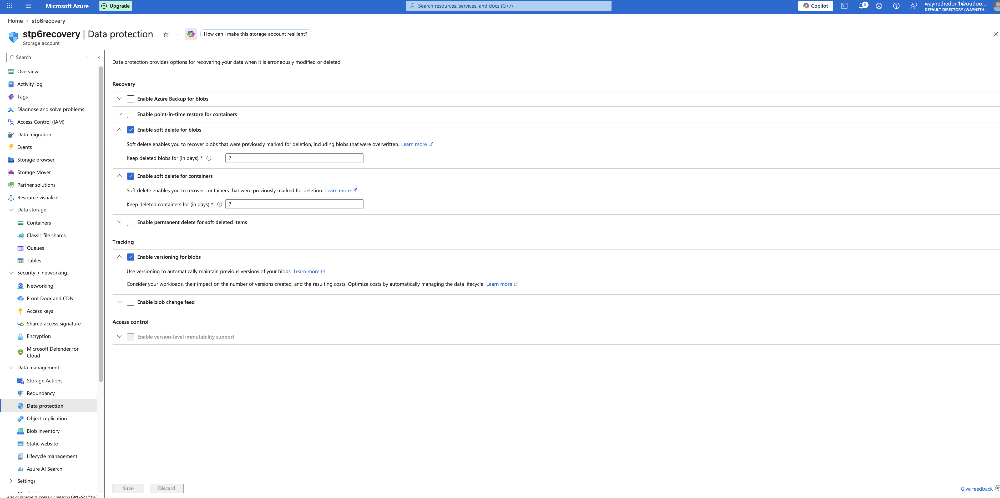
6. Lifecycle rule `p6-tiering` (code view with all conditions and the prefix filter). 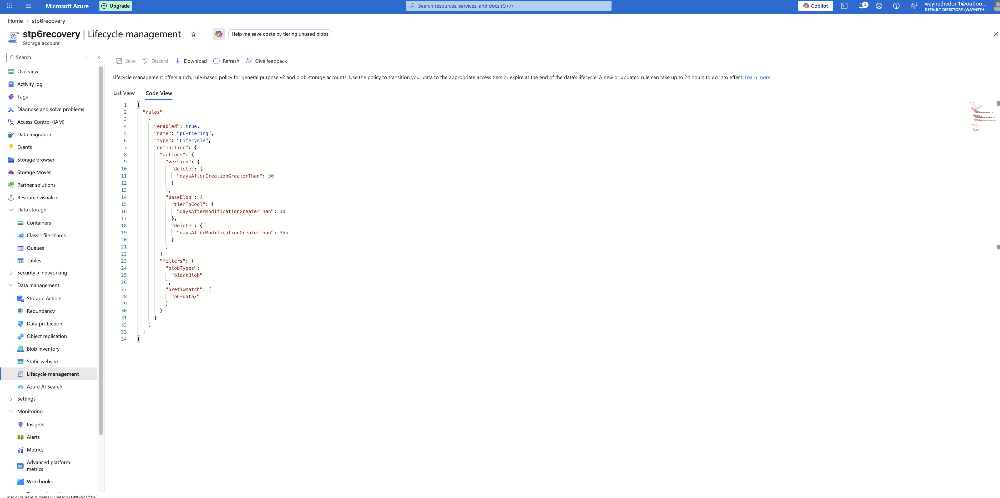 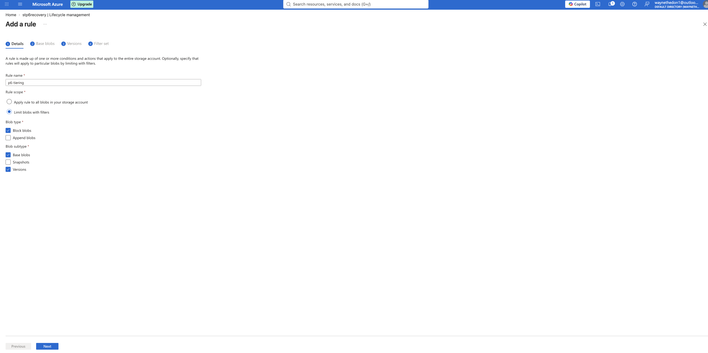
7. Versioning: `test.txt` overwritten, two versions listed. 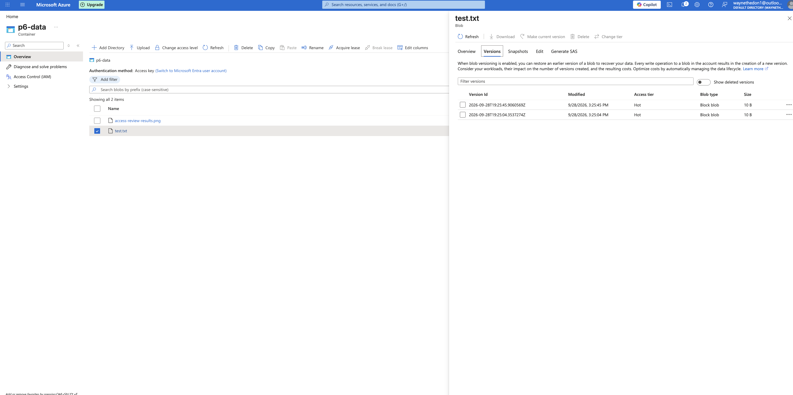
8. Previous version promoted; blob contents back to "version 1". 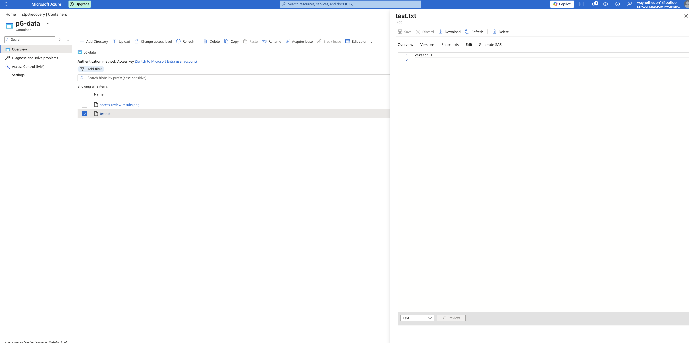
9. `delete-me.txt` deleted, still visible with the deleted-blobs view. 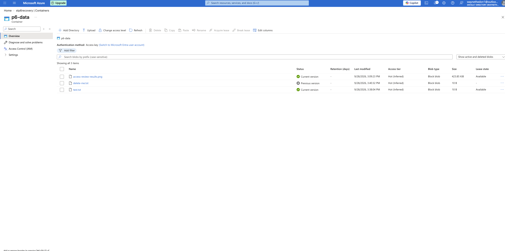
10. `delete-me.txt` recovered via **Make current version** and active again. 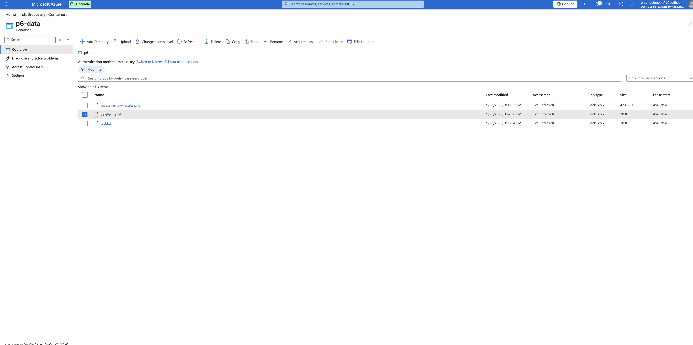

**Network restriction and SAS**

11. Storage firewall: selected networks only (my IP), trusted Microsoft services allowed. 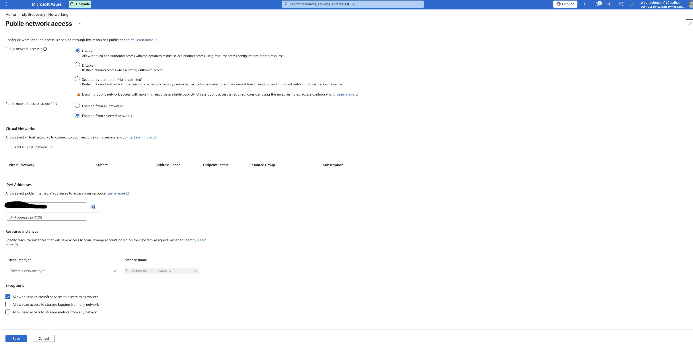
12. SAS generated: read-only, HTTPS only, expiry 20:00:44 UTC. 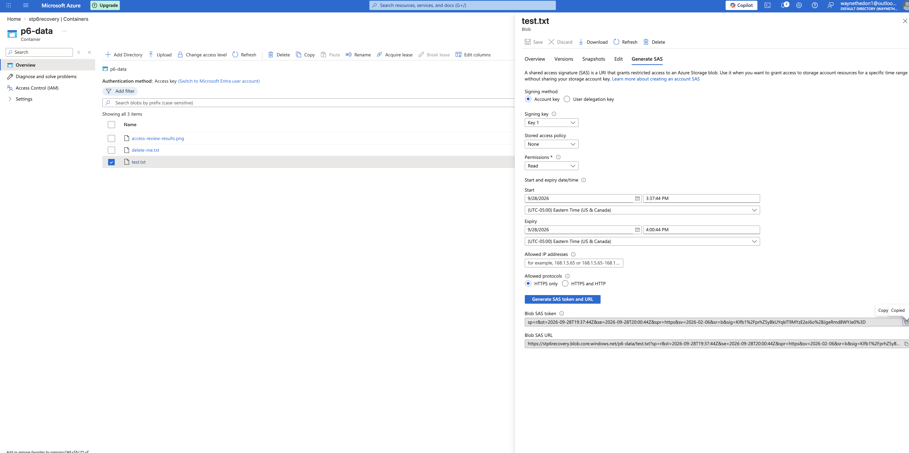
13. SAS used before expiry: `curl` returned the blob contents (`version 1`). 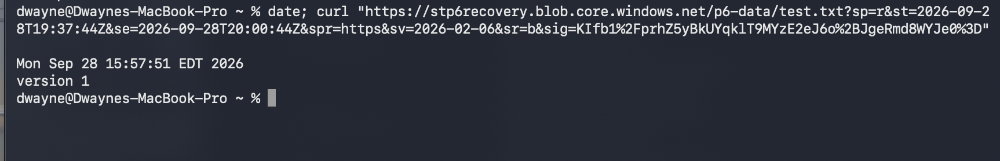
14. Same URL at 20:01:42 UTC, 58 seconds after expiry: `AuthenticationFailed`, "Signature not valid in the specified time frame". 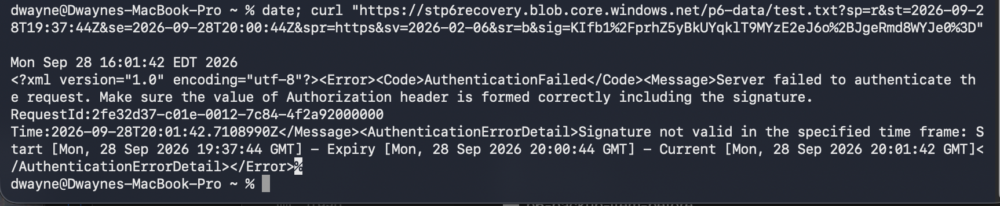

## Storage redundancy comparison

| Option | Copies and placement | Protects against | Durability (per year) |
|---|---|---|---|
| **LRS** | 3 copies in one datacenter in the primary region | Drive and server-rack failures | at least 11 nines |
| **ZRS** | 3 copies across availability zones in the primary region | Loss of an entire datacenter/zone | at least 12 nines |
| **GRS** | LRS in the primary region, copied asynchronously to the paired secondary region (stored as LRS there) | Regional outage | at least 16 nines |
| **GZRS** | ZRS in the primary region, copied asynchronously to the secondary region (stored as LRS there) | Zone failure *and* regional outage | at least 16 nines |

Points worth knowing:
- **The secondary region always uses LRS**, whichever geo option is chosen. The "Z" in GZRS applies only to the primary region.
- **GRS/GZRS secondaries are not readable by default.** The **RA-GRS** and **RA-GZRS** variants add read access to the secondary endpoint without a failover.
- **Geo-replication is asynchronous.** Microsoft states a typical RPO under 15 minutes, with no SLA on replication time.
- **The archive tier is supported on LRS, GRS and RA-GRS, but not on ZRS, GZRS or RA-GZRS.**
- **Redundancy protects against hardware and site failures, not against deletes or overwrites.** Those are replicated to every copy. That's what versioning, soft delete and backups are for, which is why this project combines them.
- ZRS and GZRS require a region with availability zones. **This project's region is North Central US (paired with South Central US).** In this account's Redundancy settings, **ZRS was greyed out**, which is consistent with the region not offering availability zones for storage. Choosing a region is therefore also a redundancy decision: a workload that needs ZRS or GZRS has to be deployed in an AZ-enabled region.

**Why LRS for this lab:** it's the cheapest option, and the data is disposable test content. For production data I would choose at least ZRS, and GZRS (or RA-GZRS) for anything that must survive a regional outage.

## How to reproduce (Portal)

1. **Resource group:** create `rg-storage-recovery` in the same region as the vault.
2. **Storage account:** Standard, LRS, hierarchical namespace **off** (blob versioning isn't supported with it). On the Data protection tab, enable blob soft delete, container soft delete, and versioning.
3. **Restore:** Recovery Services vault > Backup items > Azure Virtual Machine > the VM > **Restore VM** > pick a restore point > **Create new** > Restore type **Restore disks** > target resource group and staging storage account > Restore. Track it under Monitoring > Backup jobs.
4. **Lifecycle rule:** storage account > Data management > Lifecycle management > Add a rule, limited with a prefix filter.
5. **Versioning test:** upload a file, upload a changed copy with **Overwrite**, then blob > Versions > select the older version > **Make current version**.
6. **Deletion test:** delete a blob, switch the container view to include deleted blobs, then promote the latest version.
7. **Firewall:** Security + networking > Networking > Enabled from selected networks > **add your client IP before saving** > keep trusted Microsoft services allowed.
8. **SAS:** blob > Generate SAS > Read, HTTPS only, short expiry. Test with `curl "<SAS URL>"` (quote the URL), then repeat after expiry.

## SAS and identity notes

- The token used here is a **service SAS** signed with the account key. A key-signed SAS can't be revoked individually: it expires, or the key is rotated (which invalidates every SAS signed with it), unless it references a **stored access policy**.
- A **user delegation SAS** is signed with Microsoft Entra credentials instead of the account key (Blob storage only) and is Microsoft's recommended SAS type.
- A SAS doesn't bypass the storage firewall. The request succeeded because it came from an allowed IP.
- For internal Azure workloads, the preferred pattern is a **managed identity with a Storage Blob Data role** rather than any SAS or key. Setting **Allow storage account key access** to Disabled enforces Entra-only access.

## Cleanup

The restored disk is a Premium SSD billed while it exists, even unattached. After capturing screenshots, delete `vm1-osdisk-20260928-185643` (and, when finished, the staging container and the whole `rg-storage-recovery` resource group).

## Next steps

- Deploy a VM from the restored disk using the generated ARM template, and re-enable **Encryption at Host** (a VM-level setting that doesn't carry over to a restored disk).
- Revisit the lifecycle rule after its thresholds pass to confirm tiering actually ran.
- Replace the account-key SAS with a **user delegation SAS**, and add a **stored access policy** to demonstrate revocation.
- Disable shared key access on the account and move all access to Entra ID + RBAC.
- Enable **point-in-time restore for containers** (it requires versioning, soft delete and blob change feed) and compare it with **Azure Backup for blobs**, which uses a Backup vault rather than a Recovery Services vault.
